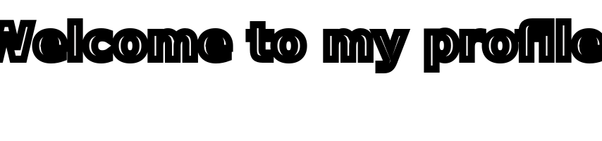

    
    
    
    
    
    

    

<h2 align="center">🏆 GitHub Profile Trophy</h2>

    

<h2 align="center">🛠️ Languages and Tools</h2>
<table align="center">
  <tr>
    <th>Category</th>
    <th>Technologies</th>
  </tr>
  <tr>
    <td>Languages / IDE</td>
    <td>
      
      
      
      
      
      
      
      
    </td>
  </tr>
  <tr>
    <td>CI / CD</td>
    <td>
      
      
      
    </td>
  </tr>
  <tr>
    <td>Databases</td>
    <td>
      
      
      
    </td>
  </tr>
  <tr>
    <td>Message Brokers</td>
    <td>
      
      
      
    </td>
  </tr>
</table>

<h2 align="center">📞 Connect with Me</h2>

  
  
  

<h2 align="center">📈 GitHub Stats</h2>

    
  
  
  

<h2 align="center">💡 About Me</h2>

    Hi! My name is Bejan and I am a passionate backend developer. I enjoy writing performant, clean and well-structured code. My main focus is Go and Python, but I am not limited to these languages. I love learning new technologies and solving complex problems, whether it is performance optimization, working with databases or building reliable APIs. 🚀

